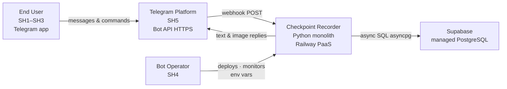
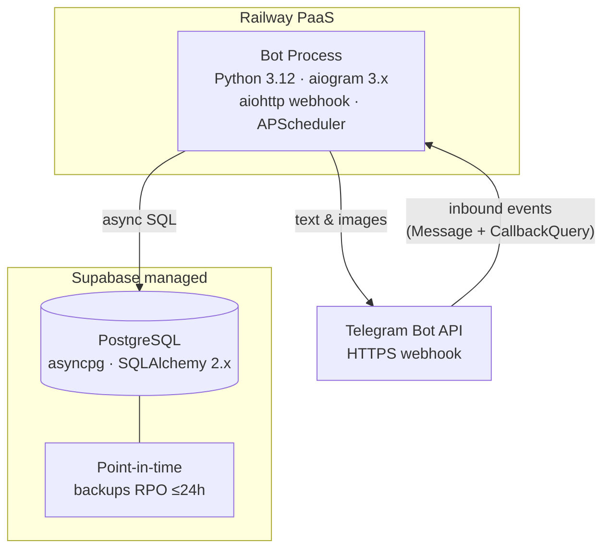
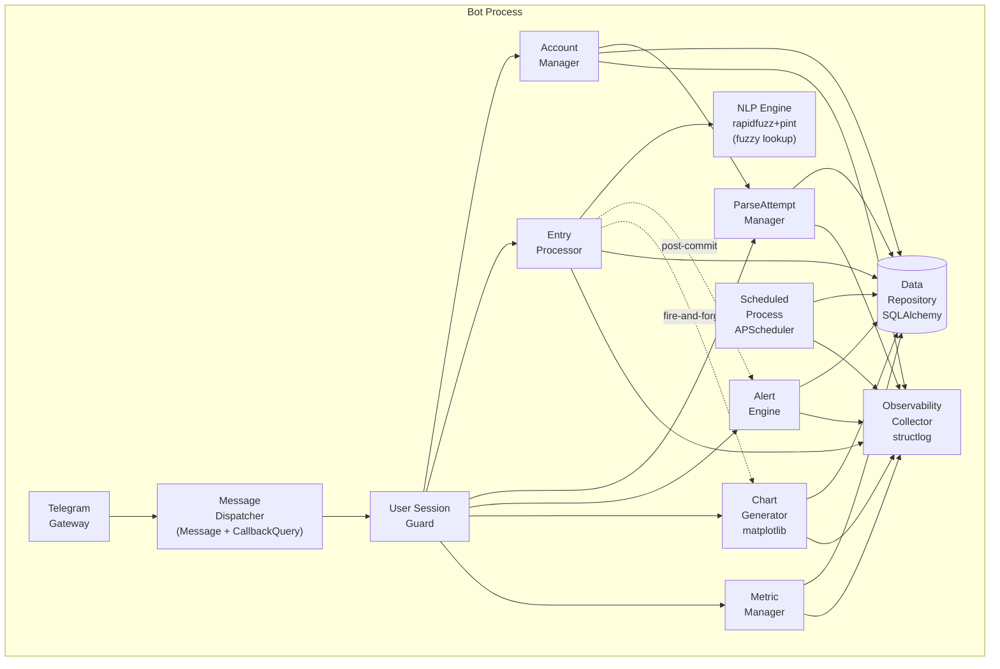

# Overview

Single-process, component-structured Python monolith deployed as a Telegram webhook bot on Railway PaaS. Persists all data in Supabase managed PostgreSQL via SQLAlchemy async + asyncpg. Renders charts in-process with matplotlib in an asyncio executor. Runs scheduled maintenance jobs via APScheduler in-process. Designed for ~10 users with a hard 20-user ceiling before an architecture review is required.

See [[use-case-diagram]] for actor-system interactions.

# C4 Level 1: Context

**Caption:** All user interaction flows through Telegram. The bot process is the only compute artifact. No direct user-to-database access.

- Actors: SH1–SH3 (end users via Telegram), SH4 (bot operator via Railway dashboard), SH5 (Telegram platform — infrastructure dependency)
- External systems: Telegram Bot API (webhook inbound + outbound), Supabase PostgreSQL, Railway PaaS

# C4 Level 2: Containers

Single-process deployment — one application container plus external managed services. No microservices, no message queue, no cache layer.

**Caption:** All functional logic lives inside one bot process. PostgreSQL is the sole durable store for all entities and the observability event log. Inbound events now include both Message events (text commands) and CallbackQuery events (inline keyboard button presses).

## Bot Process
- Tech: Python 3.12, aiogram 3.x (webhook), APScheduler 3.x, asyncio
- Responsibility: message routing, NLP parsing, data persistence orchestration, alert evaluation, chart generation, scheduled maintenance, inline keyboard callback routing
- Key libraries: rapidfuzz, pint, matplotlib (Agg), structlog, pydantic-settings, SQLAlchemy 2.x async, asyncpg, Alembic
- ADR: [[adr-001-monolith|ADR-001 Single-process monolith]], [[adr-002-telegram-gateway|ADR-002 Webhook mode]]

## PostgreSQL (Supabase)
- Tech: Managed PostgreSQL, asyncpg driver
- Responsibility: durable storage for DM1–DM8, ConversationState persistence, ObservabilityEvent log, SchedulerLock
- Key constraints: ACID transactions ([[adr-007-cascade-deletion|ADR-007]]); UniqueConstraint `(internal_user_id, metric_name)` ([[adr-011-metric-name-uniqueness|ADR-011]]); all queries scoped by internal_user_id ([[adr-005-user-isolation|ADR-005]])
- ADR: [[adr-012-technology-stack|ADR-012 Technology stack]]

# C4 Level 3: Components (Bot Process)

**Caption:** No new component box is added for the smart-metric-picker feature. Picker logic is absorbed into existing components: Message Dispatcher routes CallbackQuery events alongside text Message events; NLP Engine performs fuzzy metric lookup; USG owns the new PendingMetricPicker and PendingPickerValue ConversationState nodes; Entry Processor handles post-selection value entry; Metric Manager handles post-selection management commands. See ADR-013 for the CallbackQuery routing decision.

| Component | FRs handled | Key architectural pattern |
|---|---|---|
| Telegram Gateway | All I/O | aiogram webhook; retry 3× on auth failure then halt ([[adr-002-telegram-gateway|ADR-002]]) |
| Message Dispatcher | FR3, FR22, FR23, FR24, FR25, FR26, FR27, FR28, FR29, FR30, FR31, FR32 | Consults USG ConversationState before intent classification; routes both text Message and CallbackQuery events; callback_data encodes action type + metric_id per [[adr-013-inline-keyboard-callback-routing|ADR-013]] |
| User Session Guard | FR2, FR3, FR29, FR30 | Owns per-user ConversationState including PendingMetricPicker and PendingPickerValue states; account status gate; allowlist placeholder |
| Account Manager | FR1, FR16, FR17 | Idempotent registration; coordinates ParseAttempt Manager on PendingDeletion |
| Entry Processor | FR4, FR6, FR30 | NLP → metric lookup → atomic Entry write; periodicity prompt flow; post-picker value entry (FR30: metric pre-resolved from state_data) |
| NLP Engine | FR4, FR5, FR6, FR23 | rapidfuzz (metric matching + fuzzy picker trigger) + pint + regex (value/unit extraction); in-process; FR23: token_set_ratio ≥ SU-010 threshold triggers picker instead of ParseAttempt |
| ParseAttempt Manager | FR5, FR15 | Compensating delete on prompt failure ([[adr-009-parse-attempt-atomicity|ADR-009]]) |
| Alert Engine | FR11, FR12, FR13 | Post-commit evaluation ([[adr-003-alert-evaluation|ADR-003]]); one-shot (BR1); single retry |
| Chart Generator | FR14 | Two-phase: ack ≤5s + fire-and-forget coroutine ≤30s ([[adr-006-chart-two-phase|ADR-006]], [[adr-010-chart-coroutine|ADR-010]]) |
| Metric Manager | FR7–FR10, FR20, FR21, FR22 | Explicit create; lazy MetricActivityStatus ([[adr-004-metric-activity-status|ADR-004]]); cascade delete; serves metric catalog query for picker |
| Scheduled Process | FR18 | APScheduler; run-lock on DM8; 4 jobs + picker state timeout cleanup; idempotent; heartbeat first |
| Data Repository | All | SQLAlchemy async; mandatory internal_user_id scoping ([[adr-005-user-isolation|ADR-005]]); recency-ordered metric query for FR24 |
| Observability Collector | All (passive) | structlog; fire-and-forget; schema gate blocks raw_input |

# Tech Stack

- **Language:** Python 3.12+ — [[adr-012-technology-stack|ADR-012]]
- **Telegram framework:** aiogram 3.x (webhook mode) — [[adr-002-telegram-gateway|ADR-002]], [[adr-012-technology-stack|ADR-012]]
- **Hosting:** Railway PaaS — process supervisor, HTTPS endpoint, env var injection — [[adr-012-technology-stack|ADR-012]]
- **Database:** Supabase managed PostgreSQL + asyncpg + SQLAlchemy 2.x async + Alembic — [[adr-012-technology-stack|ADR-012]]
- **NLP:** rapidfuzz (fuzzy metric matching + picker trigger) + pint + regex (numeric/unit extraction) — in-process — [[adr-012-technology-stack|ADR-012]]
- **Charts:** matplotlib (Agg backend) + asyncio.run_in_executor — [[adr-010-chart-coroutine|ADR-010]], [[adr-012-technology-stack|ADR-012]]
- **Scheduler:** APScheduler 3.x (in-process async) — [[adr-012-technology-stack|ADR-012]]
- **Observability:** structlog (structured JSON → stderr) + PostgreSQL ObservabilityEvent table — [[adr-012-technology-stack|ADR-012]]
- **Config / secrets:** pydantic-settings + Railway env vars — [[adr-012-technology-stack|ADR-012]]

# Integrations

| External system | Protocol | Auth | Failure mode | Retry policy |
|---|---|---|---|---|
| Telegram Bot API (inbound) | HTTPS webhook POST | Bot token via env var | Token auth failure → retry 3× exp. backoff → `token_auth_failure_event` → halt; Railway supervisor restarts | 3× on auth failure only |
| Telegram Bot API (outbound) | HTTPS | Same token | Rate limit → backoff per Telegram guidance; dispatch failure → log + continue; CallbackQuery answer required within 60s or Telegram shows "loading" to user | Single retry for alert notifications; fire-and-forget for confirmations |
| Supabase PostgreSQL | TCP asyncpg | DB credentials via env var (Railway) | Write failure → no confirm sent; user asked to re-submit | SQLAlchemy connection pool auto-retry on connection loss |
| Railway PaaS | Platform-managed | Dashboard / CLI | Process crash → Railway restart policy; env var change = redeploy | Platform-managed |

# NFR Mapping

| NFR | Mechanism | Status |
|---|---|---|
| [[srs\|NFR1 Entry ack ≤5s]] | In-process NLP (no external service round-trip); async aiogram handler | met by design |
| [[srs\|NFR2 Disambiguation ≤5s]] | Same path as NFR1 | met by design |
| [[srs\|NFR3 Chart ack ≤5s / delivery ≤30s]] | Two-phase response: sync ack → fire-and-forget coroutine ([[adr-006-chart-two-phase|ADR-006]], [[adr-010-chart-coroutine|ADR-010]]) | met by design |
| [[srs\|NFR4 Uptime ≥95%]] | Railway process supervisor; webhook push-based (no polling gap); auto-restart | met by design |
| [[srs\|NFR5 Entry immutability]] | No UPDATE on Entry table; application-layer guarantee; schema enforced | met by design |
| [[srs\|NFR6 Per-user isolation]] | Mandatory internal_user_id in all repository method signatures ([[adr-005-user-isolation|ADR-005]]) | met by design |
| [[srs\|NFR7 Token confidentiality]] | pydantic-settings reads env at startup; Railway secrets; never logged | met by design |
| [[srs\|NFR8 raw_input exclusion]] | Schema validation gate at ObservabilityCollector boundary; structlog field whitelist | met by design |
| [[srs\|NFR9 Parse outcome coverage]] | parse_outcome_event emitted on every FR4/FR5 code path | met by design |
| [[srs\|NFR10 Alert eval coverage]] | alert_evaluation_event emitted on every FR12 evaluation | met by design |
| [[srs\|NFR11 Scheduler heartbeat]] | APScheduler; heartbeat emitted at start of every invocation before any work | met by design |
| [[srs\|NFR12 1-year retention]] | FR18 Scheduled Process emits retention_review_event for idle Active accounts; no auto-delete | met by design |
| [[srs\|NFR13 72h grace period]] | deletion_scheduled_timestamp guard in Scheduled Process before purge | met by design |
| [[srs\|NFR14 20 concurrent users]] | asyncio event loop; SQLAlchemy async connection pool; single process sized for ≤20 | met at portfolio scale |
| [[srs\|NFR15 raw_input purge]] | Cascade delete in single DB transaction ([[adr-007-cascade-deletion|ADR-007]]); raw_input columns included | met by design |
| [[srs\|NFR16 Zero dangling ParseAttempts]] | Compensating delete on prompt failure ([[adr-009-parse-attempt-atomicity|ADR-009]]); 30s detection window | met by design |
| [[srs\|NFR17 Metric name uniqueness]] | DB UniqueConstraint `(internal_user_id, metric_name)` ([[adr-011-metric-name-uniqueness|ADR-011]]) | met by design |
| [[srs\|NFR18 Picker keyboard ≤5s p95]] | In-process rapidfuzz fuzzy lookup (no external round-trip); metric catalog query scoped by internal_user_id; inline keyboard assembled and dispatched synchronously within the webhook handler; same latency budget as NFR1/NFR2. Capacity note: ≤20 users × ≤20 metrics = ≤400 rows; single indexed query by internal_user_id; p95 expected ≪1s at stated scale — re-evaluate at 20-user ceiling. | met by design |

# Cross-cutting concerns

## Security

- **Bot token:** injected via Railway env var; never in source, logs, or events; token failure → retry 3×, halt, supervisor restarts; rotation = Railway redeploy.
- **Per-user isolation:** All repository methods include `internal_user_id` as mandatory typed parameter — no unscoped reads exist in the public interface ([[adr-005-user-isolation|ADR-005]]). Integration tests must assert every read with mismatched user_id returns empty. Picker metric catalog query is scoped by internal_user_id; cross-user metric visibility via picker is structurally prevented (NFR6, BR4).
- **raw_input in events:** ObservabilityCollector emission boundary rejects any event containing raw_input; schema validation is structural — field whitelists in event schemas.
- **Bot access control:** Currently open — any Telegram user can register. USG contains a named allowlist check-point placeholder. Must add allowlist before any public release beyond the ~10-user cohort.
- **No personal data:** DM1 stores only opaque `internal_user_id`; no Telegram name, username, or phone ever written (BR5).
- **Metric name TOCTOU:** Eliminated by DB UniqueConstraint ([[adr-011-metric-name-uniqueness|ADR-011]]); application performs no pre-insert check.
- **Callback data integrity:** Picker callback_data encodes action type and (for `pick:`) metric_id (UUID); handler validates metric_id belongs to the requesting user before proceeding ([[adr-013-inline-keyboard-callback-routing|ADR-013]]); stale or replayed non-cancel callbacks are rejected if ConversationState ≠ PendingMetricPicker (UC16 E3); `callback_data = "cancel"` always routes to the FR31/FR32 Idle transition regardless of state (FR32). This bypass is intentional — the worst-case outcome from any non-Idle state is a harmless Idle reset with no data mutation and no command executed.

## Observability

- **Structured logs:** structlog (JSON) → stderr; Railway captures and retains.
- **Event store:** ObservabilityEvent rows in PostgreSQL — all five business success metrics computable from SQL queries against this table.
- **Key event types:** `registration_event`, `parse_outcome_event`, `alert_evaluation_event`, `chart_delivery_event`, `account_lifecycle_event`, `cascade_deletion_event`, `scheduler_heartbeat`, `token_auth_failure_event`, `conversation_state_event` (includes FR31/FR32 cancel transitions), `periodicity_prompt_event`, `picker_invocation_event`.
- **Health signal (webhook mode):** absence of webhook deliveries beyond a configured interval → Railway health check failure → restart.
- **Key SLOs:** `parse_success_rate` >85%; `entry_ack_latency_ms` ≤5,000; `chart_delivery_latency_ms` ≤30,000; `bot_uptime` ≥95% monthly; `active_users_count` pushed on each Entry write; `picker_keyboard_latency_ms` ≤5,000 (NFR18).

## Data

- **Backup:** Supabase managed point-in-time recovery; RPO ≤24h; RTO ≤4h. Must be confirmed active before first production deployment.
- **Retention:** 1-year minimum guarantee enforced by Scheduled Process (FR18); no automatic deletion of Active accounts — only `retention_review_event` emitted.
- **Cascade purge:** Single DB transaction ([[adr-007-cascade-deletion|ADR-007]]); all `raw_input` purged on account and metric deletion (NFR15).
- **GDPR / privacy:** No identity data stored (BR5); `raw_input` residual personal data risk accepted at portfolio scope (SU-008); users informed at onboarding (BR11).

## Deployment

- **Environments:** Single production instance on Railway; no staging at current scale.
- **Release:** Railway redeploy on git push; Alembic migration runs at startup via `entrypoint.sh`. DM6 enum extension (PendingMetricPicker, PendingPickerValue) requires a migration.
- **Rollback:** Railway deploy-to-previous-revision via dashboard.
- **Token rotation:** Railway env var update + redeploy; zero-downtime rotation is a Railway capability.
- **Webhook registration:** aiogram registers webhook URL at startup using the Railway-assigned HTTPS endpoint.

# ADR Index

- [[adr-001-monolith|ADR-001 Single-process monolith]] — accepted
- [[adr-002-telegram-gateway|ADR-002 Webhook mode]] — accepted
- [[adr-003-alert-evaluation|ADR-003 Post-commit in-process alert evaluation]] — accepted
- [[adr-004-metric-activity-status|ADR-004 MetricActivityStatus lazy computation on read]] — accepted
- [[adr-005-user-isolation|ADR-005 Repository-layer user isolation]] — accepted
- [[adr-006-chart-two-phase|ADR-006 Two-phase chart response]] — accepted
- [[adr-007-cascade-deletion|ADR-007 Cascade deletion atomicity — single DB transaction]] — accepted
- [[adr-008-alert-archived|ADR-008 Alert evaluation suspended for Archived metrics]] — accepted
- [[adr-009-parse-attempt-atomicity|ADR-009 ParseAttempt + prompt atomicity — compensating delete]] — accepted
- [[adr-010-chart-coroutine|ADR-010 Async chart execution — fire-and-forget coroutine]] — accepted
- [[adr-011-metric-name-uniqueness|ADR-011 Metric name uniqueness at DB layer]] — accepted
- [[adr-012-technology-stack|ADR-012 Technology stack]] — accepted
- [[adr-013-inline-keyboard-callback-routing|ADR-013 Inline keyboard CallbackQuery routing]] — accepted

# Open Questions

- Q1 NLP confidence threshold (SU-002) — proposed 0.7, configurable env var; must be confirmed before integration testing. Directly impacts NFR9 (>85% parse success rate).
- Q2 Scheduled Process cadence — recommended ≤12h; exact value is a Railway cron configuration decision.
- Q3 ParseAttempt expiry timeout (SU-001) — default 24h; must be environment-variable configurable.
- Q4 Stale ParseAttempt cleanup window (SU-006) — proposed 30 days; pending stakeholder confirmation (SRS Q1).
- Q5 Chart default time range and image format — proposed 30 days / PNG (SRS Q4).

Resolved (recorded for traceability):
- ~~AU-001~~ NLP library — resolved: rapidfuzz + pint + regex in-process ([[adr-012-technology-stack|ADR-012]])
- ~~AU-002~~ Deployment platform — resolved: Railway PaaS ([[adr-012-technology-stack|ADR-012]])
- ~~AU-003~~ Data repository — resolved: Supabase PostgreSQL ([[adr-012-technology-stack|ADR-012]])
- ~~AD-2 source~~ Polling vs. webhook — resolved: webhook mode ([[adr-002-telegram-gateway|ADR-002]])

<!-- custom section -->

# Architectural Goals

| ID | Goal | Linked business goal | Key metric |
|---|---|---|---|
| AG-1 | Low-latency user-facing responses | [[brd#G1\|G1 Reduce tracking abandonment]] | Entry ack ≤5s; disambiguation ≤5s; picker keyboard ≤5s (NFR1, NFR2, NFR18) |
| AG-2 | Reliable entry storage | [[brd#G2\|G2 Enable self-insight]] | Zero confirmations without durable write; storage failure rate tracked |
| AG-3 | Strict per-user data isolation | [[brd#G3\|G3 Protect user privacy]] | Zero cross-user visibility incidents (NFR6) |
| AG-4 | Measurable success metrics | [[brd#G4\|G4 Portfolio demonstration]] | All 5 business metrics computable from ObservabilityEvent queries |
| AG-5 | Operational simplicity | [[brd#G4\|G4 Portfolio demonstration]] | Single operator; diagnose incidents from logs alone; ≥95% uptime (NFR4) |
| AG-6 | Graceful NLP degradation | [[brd#G1\|G1 Reduce tracking abandonment]] | Zero silent input discards; ParseAttempt on every ambiguous message (BR3) |
| AG-7 | Correct lifecycle enforcement | [[brd#G3\|G3 Protect user privacy]] | 72h grace period; one-shot alerts; cascade atomicity (ADR-007) |

<!-- custom section -->

# Interaction Flows Summary

Key component-level interaction patterns. Full use case detail in UC files.

| Flow | Trigger | Components involved | Pattern |
|---|---|---|---|
| A Standard data entry | Free-text, NLP ≥ threshold | Gateway → Dispatcher → USG → Entry Processor → NLP → DB → Alert Engine → OC | Sync request/response + post-commit event ([[adr-003-alert-evaluation|ADR-003]]) |
| B Ambiguous entry | NLP < threshold; user Idle | → ParseAttempt Manager → DB → Gateway (prompt) | Sync; compensating delete on prompt failure ([[adr-009-parse-attempt-atomicity|ADR-009]]) |
| C Account deletion + purge | /account_delete confirmed; then 72h timer | Account Manager → PAM (coordinate) → DB; then Scheduled Process → DB (cascade) | Sync setup + scheduled batch purge ([[adr-007-cascade-deletion|ADR-007]]) |
| D Alert during active ParseAttempt | Entry triggers alert while PendingDisambiguation | Alert Engine → Gateway (distinctly formatted block) | Concurrent; formatting distinction is sole mitigation |
| E Scheduled retention/cleanup | APScheduler ≤12h | Scheduled Process → DB (run-lock → 4 jobs → release) → OC | Batch; idempotent; heartbeat emitted first |
| F Account restoration | Any message while PendingDeletion | USG (detects status) → Account Manager → PendingRestorationConfirmation | Sync state transition |
| G Late categorization | /deferred_categorize | ParseAttempt Manager → Entry Processor → DB; entry_timestamp = original time | Sync; preserves chronological integrity |
| H Metric archival/reactivation | /metric_archive, /metric_reactivate | Metric Manager → DB; alert evaluation suspension/resume | Clean state transition; no cascade |
| I Compound first-contact | New user; first message is parseable entry | Account Manager → DB (register) → Entry Processor → NLP (compound) | Sequential: onboarding atomic first; entry processing secondary |
| J Metric Picker | Bare/fuzzy command; no exact metric name match | Gateway → Dispatcher (CallbackQuery route per ADR-013) → USG (PendingMetricPicker state) → NLP Engine (fuzzy lookup) → DB (recency-ordered metric catalog) → Gateway (inline keyboard); on selection: Dispatcher (CallbackQuery) → USG → Entry Processor (logging) or Metric Manager (management) | Sync state machine with inline keyboard callback; callback_data encodes action type + metric_id; Cancel button on any picker keyboard → FR31/FR32 Idle path, no DB ownership check ([[adr-013-inline-keyboard-callback-routing|ADR-013]]) |

<!-- custom section -->

# Failure Scenarios

| Scenario | Detection | Mitigation | Residual risk |
|---|---|---|---|
| Telegram token auth failure | `token_auth_failure_event` before halt | Retry 3× exp. backoff → halt → Railway restart; operator rotates token | Bot offline until operator intervenes |
| DB unavailable (write) | Write errors; no confirmation sent | User notified to re-submit; operator alert via absent events | Data entered during outage lost unless user re-submits |
| NLP Engine failure | parse_success_rate → 0% in Observability | ParseAttempt flow provides manual fallback; operator investigates | UX degrades significantly |
| Alert evaluation failure | `alert_evaluation_event`(outcome=failed) | Entry preserved; failure logged | User may miss threshold notification |
| Alert notification dispatch failure (after retry) | `alert_evaluation_event`(dispatch_outcome=failed_after_retry) | Alert Triggered; user must re-arm | User misses notification without knowing it |
| Chart coroutine crash after ack | `chart_invocation_event` present; `chart_delivery_event` absent | Top-level exception handler sends error as second message; emits `chart_delivery_event`(failed) | If exception uncaught: user gets ack, no chart, no error |
| Scheduled Process failure | `scheduler_heartbeat` absent >2 intervals | Idempotent design; manual re-run by operator | PendingDeletion commitments unmet during failure window |
| Concurrent scheduler invocations | `scheduler_overlap_event` | DB run-lock (DM8 SchedulerLock) atomic check-and-set | Stale lock blocks next run until overridden |
| Dangling Pending ParseAttempt | `parse_attempt_event`(Pending) + no prompt within 30s | Compensating delete ([[adr-009-parse-attempt-atomicity|ADR-009]]); `dangling_parse_attempt_alert` event | If compensating delete also fails: operator must manually clear |
| Concurrent first-message race | DB unique constraint violation | DB UniqueConstraint on telegram_user_id; upsert semantics | None — DB is the atomic guard |
| Cascade deletion partial failure | Cascade count mismatch in `cascade_deletion_event` | Single DB transaction rollback; user retries ([[adr-007-cascade-deletion|ADR-007]]) | None — atomic rollback preserves all data |
| ObservabilityCollector unavailable | `collector_heartbeat` absent | Fire-and-forget: main flows continue; events written to stderr | All 5 business metrics uncomputable during outage |
| Picker session abandoned (user ignores inline keyboard) | PendingMetricPicker state age > SU-009 (24h) detected by Scheduled Process | Scheduled Process clears ConversationState → Idle; user notified "Metric selection timed out"; no entry stored; no command executed | Until Scheduled Process runs (≤12h cadence), state remains stale; any new picker command (FR22/FR23) replaces the old session (BR13), so the user is not blocked; only `/cancel` or a new picker clears immediately |

<!-- custom section -->

# Traceability Matrix

| Business goal | Architectural goal | Key components | Key ADRs | Primary risks |
|---|---|---|---|---|
| [[brd#G1\|G1 Reduce tracking abandonment]] | AG-1 (latency), AG-6 (NLP degradation) | Gateway, Entry Processor, NLP Engine, ParseAttempt Manager, USG, Message Dispatcher | ADR-001 (monolith), ADR-003 (alert decoupling), ADR-009 (PA atomicity), ADR-013 (CallbackQuery routing) | RISK2 (parse failures); RISK3 (duplicate metrics) |
| [[brd#G2\|G2 Enable self-insight]] | AG-2 (reliable storage), AG-4 (measurable) | Chart Generator, Alert Engine, Data Repository, Observability Collector | ADR-006 (two-phase chart), ADR-010 (coroutine), ADR-003 (post-commit eval) | RISK6 (no export); RISK2 (immutable wrong entries) |
| [[brd#G3\|G3 Protect user privacy]] | AG-3 (isolation), AG-7 (lifecycle) | Data Repository, Account Manager, Scheduled Process, Metric Manager | ADR-005 (isolation), ADR-007 (cascade atomicity), ADR-011 (uniqueness) | RISK5 (cross-user leak); RISK7 (raw_input personal data) |
| [[brd#G4\|G4 Portfolio demonstration]] | AG-4 (measurable), AG-5 (operational simplicity) | Observability Collector, Scheduled Process, all components | ADR-001 (monolith), ADR-002 (webhook), ADR-012 (tech stack) | RISK8 (single operator bus factor) |
