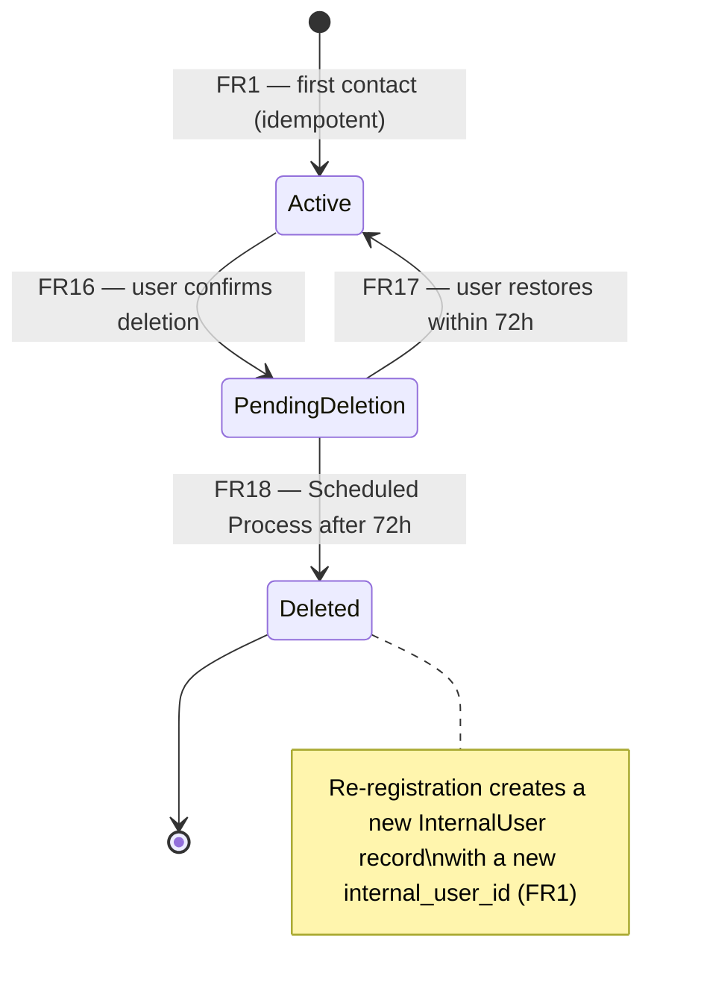
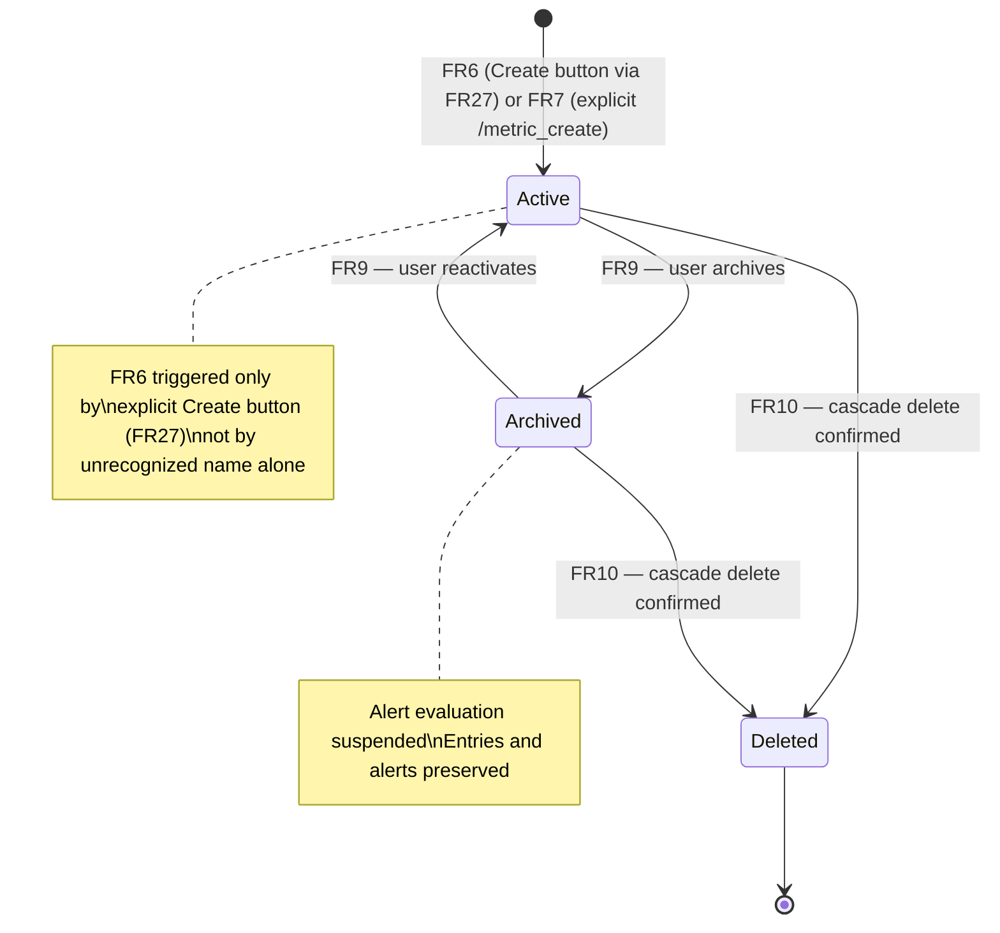
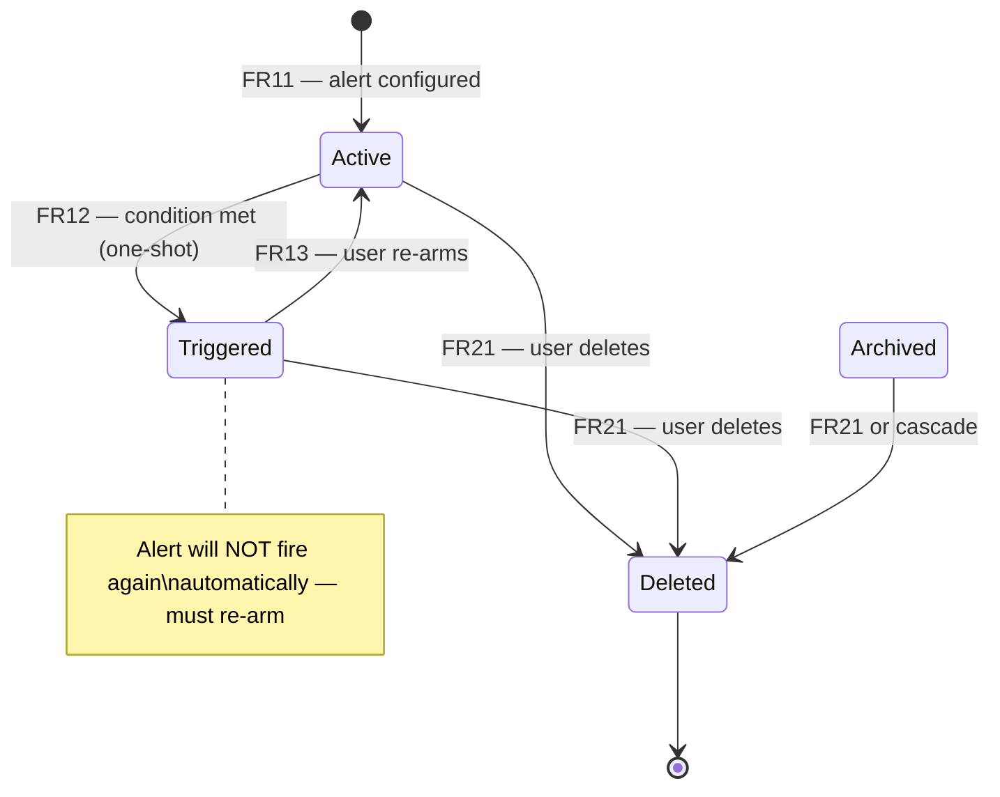
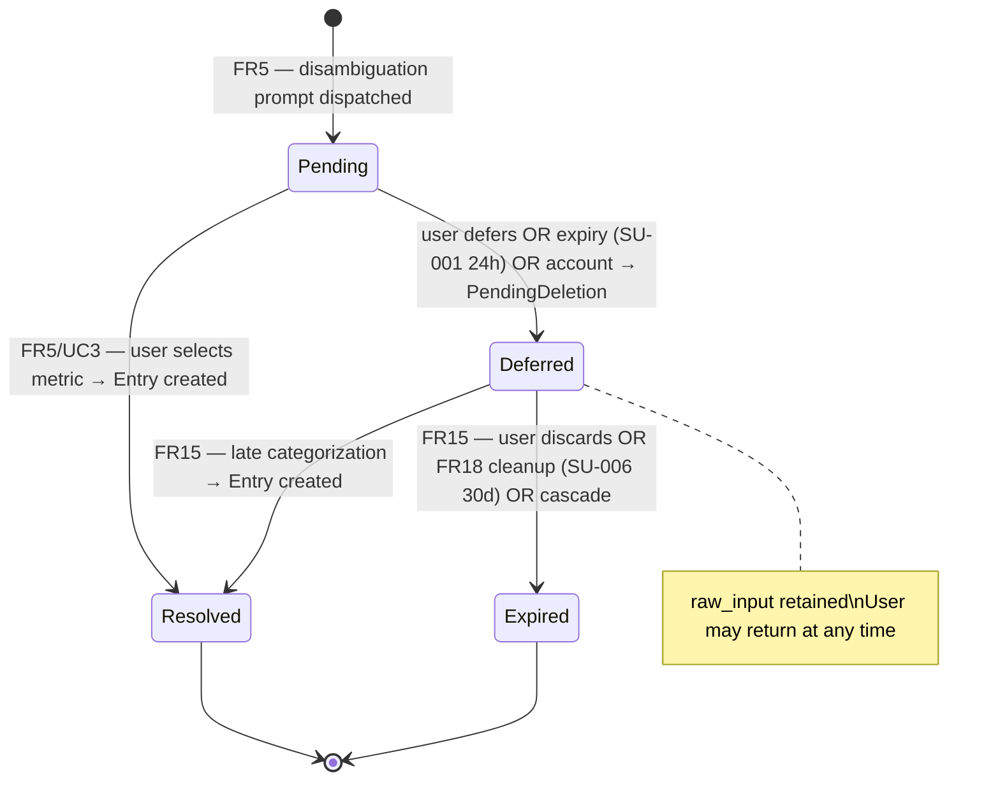
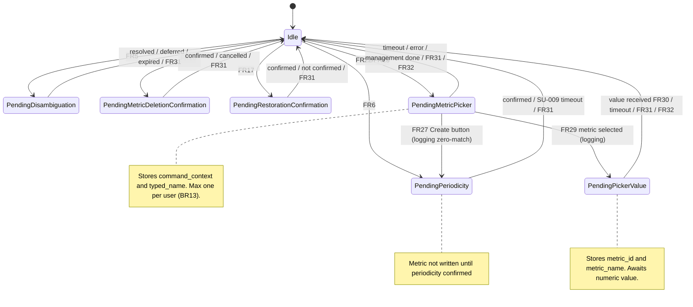

# Scope

Single-process Telegram bot that receives free-text messages from registered users, interprets them as metric data entries via in-process NLP, stores immutable structured data keyed to opaque user identifiers, and provides historical data access through chart rendering and threshold-based alerting. Addresses [[brd#G1|G1]]–[[brd#G4|G4]]. Designed for ~10 users with a hard ceiling of 20 concurrent users before an architecture review is required.

# Functional Requirements

- FR1 [must] @account Idempotent user registration — atomic check-and-create of InternalUser on first contact; no personal data (name, username, phone) stored; onboarding message dispatched <- [[brd#R7|R7 Opaque user ID only]], [[brd#R11|R11 Onboarding message content]], [[us-6-manage-account|US6 Manage account]]
- FR2 [must] @account Account status gate — every inbound message checked against InternalUser.account_status; PendingDeletion routed to restoration flow; Deleted treated as new first contact <- [[brd#R9|R9 Data retention and grace period]], [[us-6-manage-account|US6 Manage account]]
- FR3 [must] @General Conversation state routing — Message Dispatcher consults per-user ConversationState before intent classification; non-Idle state overrides normal routing; at most one non-Idle state per user at any time <- [[brd#R1|R1 Free-text data entry]], [[brd#R3|R3 Parse failure fallback]]
- FR4 [must] @logging Standard data entry (auto-parsed) — NLP confidence ≥ threshold; Entry record created atomically and immutably; alert evaluation triggered post-commit; confirmation dispatched <- [[brd#R1|R1 Free-text data entry]], [[brd#R2|R2 Metric auto-creation]], [[us-1-log-metric|US1 Log a metric in free text]]
- FR5 [must] @logging Ambiguous entry (ParseAttempt lifecycle) — NLP confidence < threshold; ParseAttempt created; disambiguation prompt dispatched; user selects metric or defers; input never silently discarded <- [[brd#R3|R3 Parse failure fallback]], [[us-2-resolve-ambiguous|US2 Resolve an ambiguous entry]]
- FR6 [must] @logging Metric auto-creation — triggered when user presses the "Create [typed_name]" inline button dispatched by FR27 (not auto-triggered on unrecognized name); periodicity selection prompt dispatched; Metric record NOT written until periodicity confirmed; Metric + Entry created atomically on confirmation <- [[brd#R2|R2 Metric auto-creation (updated)]], [[brd#R17|R17 Explicit Create button]], [[us-1-log-metric|US1 Log a metric in free text]]
- FR7 [must] @management Explicit metric creation via `/metric_create` — name (≤100 chars), periodicity (daily|weekly), optional unit (≤50 chars), optional ordered dimension_names; unique constraint enforced at DB layer <- [[brd#R6|R6 Metric catalog management]], [[us-3-manage-metrics|US3 Manage metric catalog]]
- FR8 [must] @management Metric listing via `/metric_list` — all Active and Archived metrics returned with name, periodicity, unit, status, and computed MetricActivityStatus (periods_filled 0–5; Active if ≥4 of last 5 periods filled) <- [[brd#R6|R6 Metric catalog management]], [[us-3-manage-metrics|US3 Manage metric catalog]]
- FR9 [must] @management Metric archival and reactivation via `/metric_archive` / `/metric_reactivate` — archival suspends alert evaluation; entries and alert configuration preserved; reactivation resumes evaluation <- [[brd#R6|R6 Metric catalog management]], [[us-3-manage-metrics|US3 Manage metric catalog]]
- FR10 [must] @management Metric deletion with cascade via `/metric_delete` — explicit confirmation required; atomic cascade: Metric + all Entries (including raw_input) + all Alerts + all ParseAttempts (including raw_input); irreversible <- [[brd#R6|R6 Metric catalog management]], [[us-3-manage-metrics|US3 Manage metric catalog]]
- FR11 [must] @alerting Alert configuration via `/alert_set` — metric, condition (above|below), threshold (finite numeric), target_dimension (null for single-value; required for compound); Alert.status = Active on creation <- [[brd#R5|R5 One-shot threshold alerts]], [[us-5-set-alerts|US5 Set and manage threshold alerts]]
- FR12 [must] @alerting Alert evaluation (post-entry) — triggered after every Entry storage; evaluates all Active alerts for the metric; one-shot: condition met → Alert.status = Triggered; notification dispatched with single retry; evaluation failure must NOT roll back the Entry <- [[brd#R5|R5 One-shot threshold alerts]], [[us-5-set-alerts|US5 Set and manage threshold alerts]]
- FR13 [must] @alerting Alert re-arming via `/alert_rearm` — Triggered → Active; last_triggered_timestamp preserved; alert resumes evaluation on next entry <- [[brd#R5|R5 One-shot threshold alerts]], [[us-5-set-alerts|US5 Set and manage threshold alerts]]
- FR14 [must] @analytics Chart generation via `/chart` — two-phase response: acknowledgment ≤5s, image delivery ≤30s via background coroutine; error message dispatched if rendering or delivery fails <- [[brd#R4|R4 Immutable history and charts]], [[us-4-view-charts|US4 View trend charts]]
- FR15 [must] @logging Late categorization of Deferred ParseAttempts via `/deferred_list` / `/deferred_categorize` — Deferred ParseAttempt → user selects metric → Entry created → ParseAttempt.status = Resolved; or user discards → Expired <- [[brd#R3|R3 Parse failure fallback]], [[us-2-resolve-ambiguous|US2 Resolve an ambiguous entry]]
- FR16 [must] @account Account deletion with 72-hour grace period via `/account_delete` — confirmation required; active Pending ParseAttempts transitioned to Deferred; account_status = PendingDeletion; deletion_scheduled_timestamp = now() + 72h <- [[brd#R9|R9 Data retention and grace period]], [[us-6-manage-account|US6 Manage account]]
- FR17 [must] @account Account restoration within grace period — any message from PendingDeletion user routed to restoration prompt; on confirmation: account_status = Active; deletion_scheduled_timestamp cleared; all data preserved <- [[brd#R9|R9 Data retention and grace period]], [[us-6-manage-account|US6 Manage account]]
- FR18 [must] @General Scheduled data purge and retention enforcement — cadence ≤12h; run-lock prevents concurrent execution; four jobs: PendingDeletion purge (atomic per user), 1-year retention review event, stale Deferred ParseAttempt cleanup, stale PendingPeriodicity cleanup; idempotent; scheduler_heartbeat emitted each run <- [[brd#R8|R8 Per-user data isolation]], [[brd#R9|R9 Data retention and grace period]]
- FR19 [must] @discovery `/help` command — static formatted list of all available commands and descriptions; no state change; no event emitted; available without registration <- [[brd#R10|R10 /help command]], [[us-7-discover-commands|US7 Discover available commands]]
- FR20 [must] @management Alert listing via `/alert_list` — all non-Deleted alerts for the user returned with metric name, target dimension, condition, threshold, and status <- [[brd#R5|R5 One-shot threshold alerts]], [[brd#R6|R6 Metric catalog management]]
- FR21 [must] @management Alert deletion via `/alert_delete` — single-step confirmation; immediate and irreversible; no grace period; applies to any alert status including Triggered <- [[brd#R5|R5 One-shot threshold alerts]], [[brd#R6|R6 Metric catalog management]]
- FR22 [must] @logging @management Metric picker — bare command trigger: when any metric-name-required command (`/chart`, `/alert_set`, `/metric_archive`, `/metric_reactivate`, `/metric_delete`) or the logging/entry flow is issued with no metric name argument, retrieve the user's full metric catalog and present it as an inline keyboard (ConversationState → PendingMetricPicker); button list ordered per FR24 <- [[brd#R12|R12 Bare command picker]], [[us-8-metric-picker|US8 Select a metric via inline picker]]
- FR23 [must] @logging @management Metric picker — fuzzy name trigger: when a metric name argument is supplied that has no exact match in the user's catalog, run rapidfuzz `token_set_ratio` against all user metric names (case-insensitive); if ≥1 result meets or exceeds threshold SU-010 (default 70, 0–100 scale), present matched metrics as inline keyboard (ConversationState → PendingMetricPicker); button list ordered per FR24; original typed name shown in message for reference; note — no custom pagination; Telegram client native scroll applies (Q-FEAT-4 resolved) <- [[brd#R13|R13 Fuzzy name picker]], [[us-8-metric-picker|US8 Select a metric via inline picker]]
- FR24 [must] @logging @management Recency ordering for picker buttons: metrics sorted descending by `MAX(entry_timestamp)` of their entries; metrics with zero entries sorted alphabetically by `metric_name` (case-insensitive) after all metrics-with-entries; this ordering applies to all picker presentations including "Show all fits" expansion <- [[brd#R14|R14 Recency ordering]], [[us-8-metric-picker|US8 Select a metric via inline picker]]
- FR25 [should] @logging @management Picker overflow — "Show all fits": when matched metrics exceed 4, display only the top 4 (by FR24 ordering) plus a "Show all fits" inline button; pressing "Show all fits" replaces the current message with an inline keyboard listing all matching metrics; no custom pagination — Telegram client native scroll handles long lists <- [[brd#R15|R15 Overflow display]], [[us-8-metric-picker|US8 Select a metric via inline picker]]
- FR26 [should] @logging @management Last-3-values context: immediately after the user selects a metric via the inline picker in any metric-name-required command, the system displays the last 3 recorded entry values for that metric (or fewer if fewer exist; "no entries yet" note if count = 0) as context **in the same message as the selection confirmation** before proceeding with the command; this applies to ALL metric-name-required commands, not only the logging flow <- [[brd#R16|R16 Last-3-values context]], [[us-8-metric-picker|US8 Select a metric via inline picker]]
- FR27 [must] @logging Create button on logging zero-match: when the picker is triggered in the logging/entry flow (free-text entry, not a management command) and rapidfuzz returns zero matches for the typed metric name, display an explicit "Create [typed_name]" inline button instead of metric choices; pressing the button leads to the existing periodicity selection and atomic create flow (FR6) with the typed name pre-filled; no metric is created before the button is pressed; no auto-creation <- [[brd#R17|R17 Create button on zero-match]], [[us-8-metric-picker|US8 Select a metric via inline picker]]
- FR28 [must] @management Management zero-match message: when the picker is triggered for a management command (`/chart`, `/alert_set`, `/metric_archive`, `/metric_reactivate`, `/metric_delete`) and rapidfuzz returns zero matches for the supplied metric name, respond with a "no matching metrics found" informational message; no picker keyboard displayed; no Create button offered; command not executed <- [[brd#R18|R18 Management zero-match]], [[us-8-metric-picker|US8 Select a metric via inline picker]]
- FR29 [must] @logging @management PendingMetricPicker state routing and timeout: ConversationState = PendingMetricPicker is set when the picker keyboard is displayed; `state_data` stores `{command_context, typed_name}` to differentiate originating command after selection; at most one active picker per user at any time (BR13); if user does not interact within SU-009 (24h default), Scheduled Process clears state to Idle and notifies user of cancellation; inline button callback received in this state routes to FR26 → then to originating command flow (UC2 for logging; UC6/UC7/UC8/UC10 for management); pressing the inline Cancel button (`callback_data = "cancel"`) produces the same outcome as FR31 <- Q-FEAT-1 resolved, [[us-8-metric-picker|US8 Select a metric via inline picker]]
- FR30 [must] @logging PendingPickerValue state routing and timeout: after the user selects a metric via the picker in the logging/entry flow (i.e., `command_context = logging`), and FR26 has displayed last-3-values, ConversationState transitions to PendingPickerValue; `state_data` stores `{metric_id, metric_name}`; system awaits a numeric value message; value received → Entry created atomically (FR4 path); validation failure → user re-prompted; timeout SU-009 (24h) → Scheduled Process clears state to Idle; PendingPickerValue is distinct from Idle+FR4 because metric is pre-resolved and routing/validation differ <- Q-FEAT-2 resolved, [[us-8-metric-picker|US8 Select a metric via inline picker]]
- FR31 [must] @General `/cancel` command — when ConversationState ≠ Idle, sets ConversationState to Idle and clears `state_data`, dispatches "Cancelled. You're back to the main menu."; when ConversationState = Idle, dispatches "Nothing to cancel." with no state change; no committed data is rolled back; applies to all non-Idle states; listed in `/help` (FR19); pre-existing implementation discovered as undocumented during smart-metric-picker feature addition <- [[brd#G1|G1 Reduce tracking abandonment]]
- FR32 [must] @logging @management Cancel button on picker keyboard — every picker keyboard display (bare command, fuzzy match, overflow expansion, and zero-match Create-button display) includes a Cancel button as the last inline button; pressing it produces an outcome identical to FR31 (`/cancel`): ConversationState → Idle, `state_data` cleared, reply = "Cancelled. You're back to the main menu."; `callback_data = "cancel"` (6 bytes); this routing applies when ConversationState is any non-Idle state (not only PendingMetricPicker) — consistent with FR31 which covers all non-Idle states <- [[brd#R19|R19 Cancel button in picker keyboard]], [[us-8-metric-picker|US8 Select a metric via inline picker]]

# Non-Functional Requirements

- NFR1 [must] @logging Performance: entry acknowledgment latency ≤5s p95 from message receipt to confirmation dispatch <- [[brd#G1|G1 Reduce tracking abandonment]], FR4
- NFR2 [must] @logging Performance: disambiguation prompt dispatch latency ≤5s p95 from message receipt <- [[brd#G1|G1 Reduce tracking abandonment]], FR5
- NFR3 [must] @analytics Performance: chart acknowledgment ≤5s p95; chart image delivery ≤30s p95 from request <- [[brd#G2|G2 Enable self-insight]], FR14
- NFR4 [must] @General Availability: monthly uptime ≥95% measured as fraction of hours with at least one successful Telegram Gateway poll cycle per hour <- [[brd#G1|G1 Reduce tracking abandonment]], [[brd#G2|G2 Enable self-insight]]
- NFR5 [must] @logging Data Integrity: Entry immutability — no UPDATE operation on the Entry table is ever issued; `value`, `dimension_assignments`, `entry_timestamp`, and `raw_input` are write-once <- [[brd#R1|R1 Free-text data entry]], FR4
- NFR6 [must] @General Security: per-user data isolation — all Data Repository queries include `internal_user_id` as a mandatory scoping parameter at the persistence layer; zero cross-user data visibility incidents <- [[brd#R8|R8 Per-user data isolation]], [[brd#G3|G3 Protect user privacy]]
- NFR7 [must] @account Security: Telegram bot token never appears in source code, log output, or any observability event payload <- [[brd#G4|G4 Portfolio demonstration]]
- NFR8 [must] @account Privacy: `raw_input` excluded from all observability event payloads; schema validation gate at the Observability Collector emission boundary rejects non-conforming events <- [[brd#R7|R7 Opaque user ID only]], [[brd#G3|G3 Protect user privacy]]
- NFR9 [must] @General Observability: 100% of NLP parse attempts produce a `parse_outcome_event` <- [[brd#G4|G4 Portfolio demonstration]], FR4, FR5
- NFR10 [must] @alerting Observability: 100% of alert evaluations produce an `alert_evaluation_event` <- [[brd#G2|G2 Enable self-insight]], FR12
- NFR11 [must] @General Observability: one `scheduler_heartbeat` emitted per scheduled interval; heartbeat gap exceeding 2× interval constitutes an operator incident <- [[brd#G4|G4 Portfolio demonstration]], FR18
- NFR12 [must] @account Data Retention: user data retained ≥1 year after `last_interaction_timestamp` for Active accounts <- [[brd#R9|R9 Data retention and grace period]], FR18
- NFR13 [must] @account Data Retention: permanent purge occurs no earlier than 72 hours after `deletion_scheduled_timestamp` <- [[brd#R9|R9 Data retention and grace period]], FR18
- NFR14 [must] @General Scalability: stable operation at 20 concurrent users with no data isolation failures or duplicate record creation <- [[brd#G1|G1 Reduce tracking abandonment]], [[brd#G4|G4 Portfolio demonstration]]
- NFR15 [must] @account Data Integrity: all `raw_input` fields purged in full on cascade account deletion and cascade metric deletion <- [[brd#R7|R7 Opaque user ID only]], [[brd#R9|R9 Data retention and grace period]], FR10, FR18
- NFR16 [must] @logging Reliability: zero dangling Pending ParseAttempts with no dispatched disambiguation prompt after `parse_attempt_dangling_detection_window` (default 30s, configurable) <- [[brd#R3|R3 Parse failure fallback]], FR5
- NFR17 [must] @management Data Integrity: zero duplicate `(internal_user_id, metric_name)` pairs; enforced at database layer via unique constraint <- [[brd#R6|R6 Metric catalog management]], FR7
- NFR18 [must] @logging @management Performance: metric picker keyboard presented ≤5s p95 from command receipt (bare command) or NLP parse completion (fuzzy trigger), measured at Telegram Gateway send time <- [[brd#R12|R12]], [[brd#R13|R13]], FR22, FR23

# Data Model

## DM1 InternalUser

- `id`: uuid, pk
- `telegram_user_id`: bigint, unique, not null, indexed
- `account_status`: enum(Active|PendingDeletion|Deleted), not null, default Active
- `registration_timestamp`: timestamptz, not null
- `last_interaction_timestamp`: timestamptz, not null
- `deletion_scheduled_timestamp`: timestamptz, nullable
- relations: 1 → many DM2, 1 → 1 DM6 ConversationState
- constraints: no personal data fields (no name, username, phone) — BR5
- lifecycle: Active → PendingDeletion → Deleted (terminal); Active restored from PendingDeletion via FR17

## DM2 Metric

- `id`: uuid, pk
- `internal_user_id`: uuid, fk → DM1 (CASCADE on delete), indexed
- `name`: varchar(100), not null
- `periodicity`: enum(daily|weekly), not null
- `unit`: varchar(50), nullable
- `dimension_names`: array(varchar(50)), nullable — ordered list; populated at creation or inferred from first compound entry
- `status`: enum(Active|Archived|Deleted), not null, default Active
- `created_timestamp`: timestamptz, not null
- relations: 1 → many DM3 Entry; 1 → many DM4 Alert
- constraints: UniqueConstraint `(internal_user_id, name)` — enforced at DB layer per BR7; `dimension_names` has no duplicate elements
- lifecycle: Active ↔ Archived → Deleted (terminal); cascades DM3, DM4, DM5

## DM3 Entry

- `id`: uuid, pk
- `metric_id`: uuid, fk → DM2 (CASCADE), indexed
- `internal_user_id`: uuid, fk → DM1 (CASCADE), indexed — redundant FK for isolation queries without join
- `value`: numeric, nullable — populated for single-value entries; null if `dimension_assignments` is set
- `dimension_assignments`: jsonb, nullable — map of dimension_name → numeric value for compound entries
- `raw_input`: text, not null — verbatim original message; never emitted to observability (NFR8)
- `entry_timestamp`: timestamptz, not null — original message time (preserved for late-categorized entries)
- `stored_timestamp`: timestamptz, not null, server default now()
- constraints: immutable after INSERT — no UPDATE ever issued (NFR5, BR2); exactly one of `value` or `dimension_assignments` is non-null
- lifecycle: Stored → Deleted (cascade from DM2 or DM1 only)

## DM4 Alert

- `id`: uuid, pk
- `metric_id`: uuid, fk → DM2 (CASCADE), indexed
- `internal_user_id`: uuid, fk → DM1 (CASCADE), indexed
- `condition`: enum(above|below), not null
- `threshold_value`: numeric, not null — finite; NaN and ±Infinity rejected at input
- `target_dimension`: varchar(50), nullable — null for single-value metrics; required for compound metrics (must name a dimension in DM2.dimension_names)
- `status`: enum(Active|Triggered|Archived|Deleted), not null, default Active
- `last_triggered_timestamp`: timestamptz, nullable
- `created_timestamp`: timestamptz, not null
- lifecycle: Active → Triggered → Active (re-arm via FR13) | Deleted (cascade)

## DM5 ParseAttempt

- `id`: uuid, pk
- `internal_user_id`: uuid, fk → DM1 (CASCADE), indexed
- `raw_input`: text, not null — retained verbatim; purged on Expired or cascade delete
- `candidate_metrics`: jsonb, not null — ordered list of `{metric_id, name}` pairs
- `status`: enum(Pending|Resolved|Deferred|Expired), not null, default Pending
- `expiry_timestamp`: timestamptz, not null — set to now() + SU-001 (default 24h) at creation
- `created_timestamp`: timestamptz, not null
- `resolved_metric_id`: uuid, fk → DM2 (SET NULL on delete), nullable
- constraints: at most one status=Pending ParseAttempt per user at any time
- lifecycle: Pending → Resolved (terminal) | Pending → Deferred → Expired (terminal)

## DM6 ConversationState

- `internal_user_id`: uuid, pk, fk → DM1 (CASCADE)
- `state`: enum(Idle|PendingDisambiguation|PendingPeriodicity|PendingMetricDeletionConfirmation|PendingRestorationConfirmation|PendingMetricPicker|PendingPickerValue), not null, default Idle
- `state_data`: jsonb, nullable — flow-specific context; key examples:
  - PendingPeriodicity: `{"pending_metric_name": "weight"}`
  - PendingMetricPicker: `{"command_context": "logging"|"chart"|"alert_set"|"metric_archive"|"metric_reactivate"|"metric_delete", "typed_name": "<user-typed string or null>"}` — differentiates originating command after selection (Q-FEAT-1 resolved)
  - PendingPickerValue: `{"metric_id": "<uuid>", "metric_name": "<string>"}` — metric pre-resolved; system awaits numeric value (Q-FEAT-2 resolved)
- `updated_timestamp`: timestamptz, not null
- constraints: one record per user; persisted to DB; survives process restarts; at most one non-Idle state per user (BR13)

> **DISCREPANCY:** `docsOLD/requirements/technology.md` states "FSM / ConversationState: aiogram built-in FSM, Persisted via SQLAlchemy storage backend." The current `src/checkpoint_recorder/bot.py` creates a plain `Dispatcher()` with no FSM storage backend and a comment "ConversationState is managed in DB directly (no FSM storage required)." Implementation uses direct DB row management, not aiogram FSM. Resolution deferred to bot description update per stakeholder instruction — do not edit code.

## DM7 MetricActivityStatus (derived)

- `metric_id`, `internal_user_id`: composite key (not persisted as a row)
- `status`: Active if `periods_filled ≥ 4`, else Inactive
- `periods_filled`: integer 0–5 — count of distinct periods (within last 5 of metric's own periodicity) with at least one Entry
- `computation_timestamp`: the time of last computation
- constraints: lazy-computed on read (not a stored row); recomputed if older than one periodicity unit (1 day for daily, 7 days for weekly)

## DM8 SchedulerLock

- `id`: integer, pk, singleton (always id=1)
- `locked_at`: timestamptz, nullable
- `locked_by`: varchar(255), nullable
- constraints: atomic check-and-set on lock acquisition; explicit release on invocation completion; stale if `locked_at < now() - 2× scheduled_interval`

# Command Interface

Telegram bot interface — no REST API. All interaction is via Telegram messages (free-text or commands). Commands prefixed `/`. Auth levels: `open` (any user including unregistered); `active` (InternalUser.account_status = Active, Idle ConversationState unless noted).

| Command / Input | Auth | Parameters | Success response | Error response | FR |
|---|---|---|---|---|---|
| (free text) | active | Raw message — NLP parsed; if metric name has no exact match and ≥1 fuzzy match → UC16 intercepts before FR4 lookup; if zero fuzzy matches → FR27 Create button shown | Confirmation (≤5s) or picker keyboard or periodicity prompt | Re-submit notice if storage fails | FR4, FR6, FR22, FR23, FR27 |
| `/help` | open | None | Formatted command list | — | FR19 |
| `/metric_create` | active | `name` periodicity [`unit`] [`dimension_names`...] | Metric summary with id | Duplicate name / invalid periodicity / validation error | FR7 |
| `/metric_list` | active | None | All Active+Archived metrics with MetricActivityStatus | Empty-list notice if none | FR8 |
| `/metric_archive` | active | `[metric_name]` — optional; bare command triggers picker (FR22) | Confirmation with suspended alert note | Not found / already Archived / zero fuzzy matches (FR28) | FR9, FR22, FR23, FR28 |
| `/metric_reactivate` | active | `[metric_name]` — optional; bare command triggers picker (FR22) | Confirmation with resumed alert note | Not found / already Active / zero fuzzy matches (FR28) | FR9, FR22, FR23, FR28 |
| `/metric_delete` | active | `[metric_name]` — optional; bare command triggers picker (FR22) | Confirmation prompt (lists cascade scope) → on confirm: deletion confirmation | Not found / user cancels / zero fuzzy matches (FR28) | FR10, FR22, FR23, FR28 |
| `/alert_set` | active | `[metric_name] condition threshold [dimension]` — metric_name optional; bare command triggers picker (FR22) | Alert summary | Archived metric / bad dimension / non-finite threshold / zero fuzzy matches (FR28) | FR11, FR22, FR23, FR28 |
| `/alert_list` | active | None | All non-Deleted alerts with status | Empty-list notice | FR20 |
| `/alert_rearm` | active | `alert_id` | Confirmation | Alert not Triggered | FR13 |
| `/alert_delete` | active | `alert_id` | Confirmation prompt → on confirm: deletion confirmation | Not found | FR21 |
| `/chart` | active | `[metric_name] [time_range]` — metric_name optional; bare command triggers picker (FR22) | "Generating chart…" (≤5s) → image (≤30s) | No entries / rendering failure / zero fuzzy matches (FR28) | FR14, FR22, FR23, FR28 |
| `/deferred_list` | active | None | List of Deferred ParseAttempts with raw_input and timestamps | Empty-list notice | FR15 |
| `/deferred_categorize` | active | `pa_id metric_name` | Entry confirmation | Non-Deferred PA / Archived metric | FR15 |
| `/account_delete` | active | None | Confirmation prompt → on confirm: grace period notice | User cancels | FR16 |
| `/cancel` | active | None | "Cancelled. You're back to the main menu." | "Nothing to cancel." (if already Idle) | FR31 |
| (inline button — metric selection) | active | Callback data: `{picker_metric_id}` — user presses a metric name button; routed when ConversationState = PendingMetricPicker | Last-3-values + selection confirmation in one message (FR26) → originating command proceeds | Expired session / dispatch error | FR26, FR29, FR30 |
| (inline button — Create metric) | active | Callback data: `{action: "create", typed_name: "<str>"}` — user presses "Create [typed_name]" button; logging zero-match flow only; routed when ConversationState = PendingMetricPicker | Periodicity prompt (FR6 path begins) | — | FR27 |
| (inline button — Cancel picker) | active | Callback data: `"cancel"` — user presses Cancel button on any picker keyboard; routed when ConversationState = PendingMetricPicker | "Cancelled. You're back to the main menu." (same as FR31) | — | FR31, FR32 |

# Use Cases

![[use-case-diagram.puml]]

Source: [[use-case-diagram|use-case-diagram.puml]]

- [[uc-1-onboard|UC1 Onboard new user]] <- FR1, FR2, FR3, @account
- [[uc-2-log-metric|UC2 Log metric (auto-parsed)]] <- FR4, FR6, FR12, @logging
- [[uc-3-resolve-ambiguous|UC3 Resolve ambiguous entry]] <- FR5, FR3, @logging
- [[uc-4-create-metric|UC4 Create metric explicitly]] <- FR7, @management
- [[uc-5-list-metrics|UC5 List metrics]] <- FR8, @management
- [[uc-6-archive-metric|UC6 Archive or reactivate metric]] <- FR9, @management
- [[uc-7-delete-metric|UC7 Delete metric]] <- FR10, FR3, @management
- [[uc-8-configure-alert|UC8 Configure threshold alert]] <- FR11, @alerting
- [[uc-9-rearm-alert|UC9 Re-arm triggered alert]] <- FR13, @alerting
- [[uc-10-request-chart|UC10 Request trend chart]] <- FR14, @analytics
- [[uc-11-categorize-deferred|UC11 Categorize deferred entry]] <- FR15, @logging
- [[uc-12-delete-account|UC12 Delete account]] <- FR16, FR2, @account
- [[uc-13-restore-account|UC13 Restore account]] <- FR17, FR2, @account
- [[uc-14-request-help|UC14 Request help]] <- FR19, @discovery
- [[uc-15-manage-alerts|UC15 List and delete alerts]] <- FR20, FR21, @management
- [[uc-16-select-metric-picker|UC16 Select metric via inline picker]] <- FR22, FR23, FR24, FR25, FR26, FR27, FR28, FR29, FR30, FR31, FR32, @logging, @management

# State Machines

## DM1 InternalUser lifecycle

## DM2 Metric lifecycle

## DM4 Alert lifecycle

## DM5 ParseAttempt lifecycle

## DM6 ConversationState lifecycle

# Business Rules

- BR1 [must] @alerting One-shot alert: after an Alert transitions to Triggered, it will not fire again automatically. Condition: Alert.status = Triggered after FR12 evaluation. Enforced at: Alert Engine (FR12), onboarding message (FR1). Risk if violated: user assumes continuous monitoring; silent threshold breach.
- BR2 [must] @logging Entry immutability: once an Entry record is written, its `value`, `dimension_assignments`, `entry_timestamp`, and `raw_input` are never modified. Condition: any write to an existing Entry row. Enforced at: Data Repository layer — no UPDATE on Entry table (NFR5). Risk if violated: historical data integrity lost; charts become unreliable.
- BR3 [must] @logging No silent parse failure: when NLP cannot auto-parse with sufficient confidence, a ParseAttempt is created and the user is prompted. Silent discard is prohibited. Condition: NLP outcome ≠ auto-parse. Enforced at: Entry Processor / ParseAttempt Manager routing (FR5). Risk if violated: user loses data without notification.
- BR4 [must] @General Per-user data isolation: no query or response may return data belonging to a different user's `internal_user_id`. Condition: all data reads. Enforced at: Data Repository layer — all queries parameterized by `internal_user_id` (NFR6); not at application filtering layer. Risk if violated: critical trust and privacy failure (RISK5).
- BR5 [must] @account No personal data storage: system must not store Telegram username, display name, phone number, or email. Condition: user registration (FR1) and any subsequent write. Enforced at: Account Manager; DB schema (no personal data fields on DM1). Risk if violated: GDPR exposure (RISK7).
- BR6 [must] @account raw_input excluded from observability: no observability event may contain `raw_input` or any verbatim user message text. Condition: all event emissions. Enforced at: schema validation gate at Observability Collector emission boundary (NFR8). Risk if violated: personal data leakage into logs.
- BR7 [must] @management Metric name uniqueness per user: a user cannot have two Metrics with the same name. Condition: Metric creation (FR7, FR6). Enforced at: DB-layer UniqueConstraint `(internal_user_id, name)` (NFR17). Risk if violated: history fragmentation across duplicate metrics (RISK3).
- BR8 [must] @management Cascade deletion atomicity: deleting a Metric or user account must delete all associated records in a single atomic operation. Condition: FR10 (metric delete), FR18 (account purge). Enforced at: Data Repository transaction boundary. Risk if violated: orphaned records; potential cross-user data leakage from orphaned entries.
- BR9 [must] @logging Periodicity closed vocabulary: Metric.periodicity must be exactly `daily` or `weekly`; no other values are accepted. Condition: Metric creation (FR6, FR7). Enforced at: input validation; DB enum constraint. Risk if violated: MetricActivityStatus computation breaks; retention metric unmeasurable.
- BR10 [must] @account PendingDeletion grace period: permanent user data purge must not occur sooner than 72 hours after `deletion_scheduled_timestamp`. Condition: FR18 Scheduled Process PendingDeletion purge step. Enforced at: Scheduled Process timestamp guard. Risk if violated: premature data loss; violates user-facing retention commitment.
- BR11 [must] @account Onboarding message content: every new user registration must dispatch an onboarding message explicitly stating: (a) 1-year minimum data retention, (b) no data export, (c) verbatim `raw_input` storage, (d) one-shot alert behavior. Condition: InternalUser creation (FR1). Enforced at: Account Manager onboarding message composition. Risk if violated: users uninformed of privacy practices and behavioral constraints.
- BR12 [must] @account Compound first-contact boundary: if a user's first message is also a data entry, onboarding (FR1) must complete before entry processing begins. Entry failure after successful onboarding must produce an explicit user notification to re-submit — never silently lost. Condition: FR1 compound flow. Enforced at: Account Manager / Entry Processor coordination. Risk if violated: silent data loss at first contact (RISK2).
- BR13 [must] @logging @management Picker session exclusivity: at most one active PendingMetricPicker session per user at any time. Condition: on FR22/FR23 picker trigger. Enforced at: DM6 ConversationState constraint (one non-Idle state per user, FR3); UC16. Risk if violated: two concurrent picker sessions could result in metric selection being applied to the wrong command context.
- BR14 [must] @logging No silent metric creation: the system must not create a Metric record as a result of a user typing an unrecognized metric name alone; creation requires an explicit user action (pressing the "Create [typed_name]" inline button per FR27). Condition: on any unrecognized name in the logging/entry flow. Enforced at: FR27 (trigger), FR6 (create, only on button press). Risk if violated: spurious metrics created in user catalog, fragmenting history (RISK3).

# Open Questions

- Q1 OI-4 — Deferred ParseAttempt cleanup window (SU-006) — proposed default 30 days; pending stakeholder confirmation. Affects FR18 step 4.
- Q2 OI-5 — MetricActivityStatus staleness tolerance — proposed: recompute if `computation_timestamp < now() - 1 periodicity unit`; pending confirmation. Affects FR8 correctness.
- Q3 OI-6 — Alert listing and delete command names (/alert_list, /alert_delete) and exact response format not specified in source. Included as FR20, FR21 per Flow 9 in system_analysis.md. Confirm command names.
- Q4 OI-7 — Chart default time range and image format — proposed 30 days / PNG / one line per dimension. Pending confirmation. Affects FR14.
- Q5 OI-8 — Re-registration Telegram ID mapping atomicity — when a Deleted user re-registers, the Telegram_user_id → new internal_user_id mapping must be atomic. Confirm this is enforced in FR1 (Account Manager registration flow).

- Q6 Q-FEAT-1 resolved — shared `PendingMetricPicker` ConversationState used for both bare-command and fuzzy-match triggers; `state_data.command_context` distinguishes originating command. No open items.
- Q7 Q-FEAT-2 resolved — `PendingPickerValue` is a distinct new ConversationState node for the post-selection value-await step in the logging flow. No open items.
- Q8 Q-FEAT-3 resolved — rapidfuzz `token_set_ratio`, threshold = 70 (SU-010, configurable). No open items.
- Q9 Q-FEAT-4 resolved — native Telegram client scroll; no custom pagination needed for "Show all fits". No open items.
- ~~Q10~~ **Resolved 2026-04-28:** PendingMetricPicker + free-text → show reminder: "Please select a metric from the keyboard above, or use /cancel to cancel action." State not cleared. FR29 and UC16 edge case updated.
- ~~Q11~~ **Resolved 2026-04-28:** Last-3-values context displayed in the same message as the selection confirmation. FR26 updated.
- ~~Q12~~ **Resolved 2026-04-28:** PendingPeriodicity reused unchanged for the FR27 Create-button flow. No new state needed.

Resolved from source (recorded for traceability):
- ~~OI-2~~ NLP library: resolved — rapidfuzz (fuzzy metric matching) + pint + regex (numeric/unit extraction); in-process (technology.md)
- ~~OI-3~~ Data Repository: resolved — Supabase managed PostgreSQL + asyncpg + SQLAlchemy 2.x async (technology.md)

<!-- custom section -->

# Periodicity Vocabulary

Closed vocabulary; free-form strings rejected at input validation. Future expansion requires new explicit period boundary definitions before those values can be accepted.

| Value | Period boundary | "Last 5 periods" definition | Active threshold |
|---|---|---|---|
| `daily` | Calendar day: 00:00–23:59 UTC | Last 5 calendar days including today | ≥4 distinct calendar days with at least 1 Entry |
| `weekly` | Calendar week: Monday 00:00 – Sunday 23:59 UTC | Last 5 complete calendar weeks before start of current week | ≥4 distinct weeks with at least 1 Entry |

Period boundary timezone: UTC default (SU-007); per-user timezone preference deferred to future iteration.

<!-- custom section -->

# Dimension Naming Convention

For compound entries (e.g., `bench press 80kg 5reps`), dimension names are assigned in priority order:

1. **Named at metric creation (highest priority)** — Metric.dimension_names defines the ordered mapping; values are assigned to names in definition order.
2. **Inferred from first compound entry (second priority)** — unit tokens embedded in raw input (e.g., `kg`, `reps`) become dimension names.
3. **Positional fallback (lowest priority)** — if no named dimensions available: `value_1`, `value_2`, etc.

Consistency requirement: the naming convention for a metric is locked after the first compound Entry. Subsequent entries must follow the same convention. Dimension name changes require metric reconfiguration (not in scope for this version).

Alert configuration constraint: `Alert.target_dimension` must name a dimension that has appeared in at least one stored Entry for that metric. Alerts on never-logged dimensions are rejected at FR11 step.

<!-- custom section -->

# System Decision Log

| ID | Decision | Rationale | Status |
|---|---|---|---|
| SD-001 | Alerts on compound metrics reference a specific named dimension | Threshold evaluation requires a single numeric value | Confirmed |
| SD-002 | Metric auto-creation requires periodicity selection before Entry is stored | Periodicity is required for MetricActivityStatus computation; no default is appropriate | Confirmed |
| SD-003 | Alert lifecycle is one-shot; user must explicitly re-arm | Stakeholder decision: no automatic repeat notifications | Confirmed |
| SD-004 | Account deletion includes a 72-hour grace period | Stakeholder decision: provides restoration window against accidental deletion | Confirmed |
| SD-005 | `raw_input` retained as residual personal data risk; no scrubbing at portfolio scope | Functionally required for disambiguation and audit tracing; purged on deletion | Confirmed |
| SD-006 | Periodicity vocabulary is closed: `daily` \| `weekly` | Free-form periodicities cannot be computed for MetricActivityStatus | Confirmed |
| SD-007 | ParseAttempt failure or timeout transitions to Deferred, not terminal Expired | Stakeholder decision: user can always come back; input is never thrown away | Confirmed |
| SD-008 | Compound first-contact flow: onboarding is the primary atomic step | Entry failure after onboarding does not roll back registration | Confirmed |
| SD-009 | `/help` available without registration; returns static response; no state side-effects | Discoverability must not be gated behind registration | Confirmed |

<!-- custom section -->

# Uncertainty Register

| ID | Type | Description | Impact | Plan |
|---|---|---|---|---|
| SU-001 | Config | ParseAttempt expiry timeout — default 24h; configurable | Deferred ParseAttempts accumulate if too long; user confusion if too short | Confirm at deployment; make configurable env var |
| SU-002 | Algorithmic | NLP confidence threshold — default 0.7; configurable | Core >85% parse success rate at risk if miscalibrated | Tune from `parse_outcome_event` data in production |
| SU-003 | Functional | Near-duplicate metric name detection not implemented | History fragmentation across near-duplicates (RISK3) | Inform at onboarding; deferred to future iteration |
| SU-004 | Behavioral | Alert evaluation suspended for Archived metrics | Logically expected; confirmed as behavioral default | Default: evaluation suspended; resume on reactivation |
| SU-005 | Behavioral | MetricActivityStatus computation trigger | Lazy-computed on read; pushed to Observability on Entry write | Lazy with cache invalidation after 1 periodicity unit (Q2) |
| SU-006 | Config | Deferred ParseAttempt cleanup window — proposed 30 days | Unbounded Deferred accumulation | Confirm with stakeholder (Q1); make configurable |
| SU-007 | Functional | Timezone handling — UTC default | Period boundaries may feel off for non-UTC users | UTC default accepted; per-user timezone is future enhancement |
| SU-008 | Business | `raw_input` GDPR classification not formally assessed | May constitute personal data under GDPR Art. 4/9 | Accept for portfolio scope; review before scaling |
| SU-009 | Config | PendingPeriodicity / PendingMetricPicker / PendingPickerValue timeout — default 24h; configurable (shared timeout value); applies to all three states | Stale states accumulate | Scheduled Process cleans up; default consistent with SU-001 |
| SU-010 | Algorithmic | Rapidfuzz fuzzy-match threshold — default 70 (0–100 scale); scoring function `token_set_ratio` (case-insensitive); configurable env var `FUZZY_MATCH_THRESHOLD`; below threshold: picker not shown (FR27 or FR28 applies instead) | Too low → false positives, confusing picker; too high → picker misses obvious typos; core R13 testability depends on this value | Tune from picker-invocation telemetry in production; make configurable before deployment; Q-FEAT-3 resolved |
